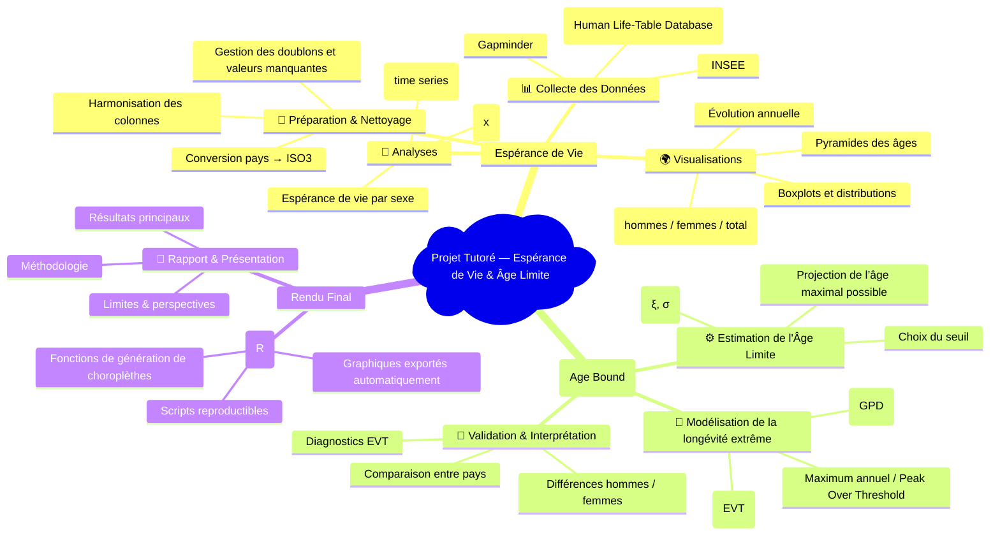

# Life Expectancy and Age Bound

## 🧭 Project Overview

This project investigates:
1. **Life Expectancy** (LE) across countries, years, age groups, and sexes.
2. **Human Maximum Lifespan (Age Bound)** estimation using Extreme Value Theory (EVT).

The workflow combines data processing, statistical analysis, geospatial visualization, and advanced mathematical modeling.

---

## 🥇 PART I — Life Expectancy Analysis

### 🎯 Objectives

- Compute and analyze **life expectancy at age x** for all available countries.  
- Study **temporal trends** from the earliest to the latest year of data.  
- Compare **male vs female** life expectancy gaps.  
- Build **global and country-specific visualizations**, including:
  - Time series
  - Boxplots and distributions
  - Choropleth world maps
  - Population pyramids  

---

### 📂 Data Used

- **Human Life-Table Database (HLD)** — primary source of life expectancy data.  
- **Gapminder** — complementary country-level demographic indicators.  
- **INSEE** — detailed demographic data for France.  

All datasets were cleaned, harmonized, and matched using country names and ISO3 codes before analysis.

---

### 🧹 Data Processing

- Removal of duplicates, missing values, and inconsistent entries  
- Selection of relevant variables:  
  **Country**, **Year**, **Age**, **Sex**, **eₓ**  
- Normalization of variable names and formats  
- Standardization of country names using **ISO3 codes**, including:
  - Automatic detection via pattern matching  
  - Conversion using the `countrycode` package  
  - Manual corrections for problematic territories such as:  
    **Kosovo**, **Indian Ocean Territories**,  
    **Ashmore and Cartier Islands**,  
    **Siachen Glacier**  
- Merging all cleaned datasets into a unified analytical dataset  

---

### 📊 Analyses Performed

- Distribution of life expectancy by **age** and **sex**  
- Time series analysis of life expectancy trends  
- **Sex gap analysis** (Female − Male)  
- Cross-country comparisons  
- Regional or continent-level comparisons  
- Ranking tables (Top 10 / Bottom 10 life expectancy values)


### 🌍 Choropleth Maps

Choropleth maps are generated automatically using:

```r
choropleth_by_year(year, age)
```

Maps are produced considering any chosen age (e.g., e(0), e(65), etc.) for:

- Male
- Female
- Male + Female

All outputs images are saved in *outputs/*

---

## 🥈 PART II — Human Maximum Lifespan (Age Bound)

### 🎯 Objectives

- Estimate the **theoretical maximum age** a human can reach.  
- Analyze **deaths at extreme ages**.  
- Apply **Extreme Value Theory (EVT)** to model exceptional lifespans.  
- Compare results **across countries** and **between sexes** (male vs female).  

---

### 📂 Data Used

- **Maximum observed age** by country and year (`x_max`).  
- Selection of extreme values using the **POT (Peak Over Threshold)** method.  
- Cleaned mortality data extracted from demographic life tables.  

---

### ⚙️ EVT Methodology

#### 1. Threshold Selection  
Select an optimal threshold **u** to retain only the most extreme age-at-death values.  
Multiple diagnostic tools (mean excess plots, stability plots) are used to choose a robust threshold.

#### 2. Modeling with the Generalized Pareto Distribution (GPD)  
The exceedances over the threshold are modeled using the **Generalized Pareto Distribution (GPD)**.  

We estimate the following parameters:

- **ξ (xi)** — shape parameter  
- **σ (sigma)** — scale parameter  

**Interpretation of ξ**:  
- **ξ < 0** → finite upper bound (suggests a maximum human lifespan)  
- **ξ ≥ 0** → no detectable upper limit to lifespan  

#### 3. Age Bound Estimation  
Using the fitted GPD model, we compute the **theoretical maximal age** (upper endpoint) implied by the data.

#### 4. Diagnostic Tools  
To validate the GPD fit and the threshold choice, we rely on:

- **Q-Q plots**  
- **Stability plots** for ξ  
- **Threshold sensitivity analysis**

---


